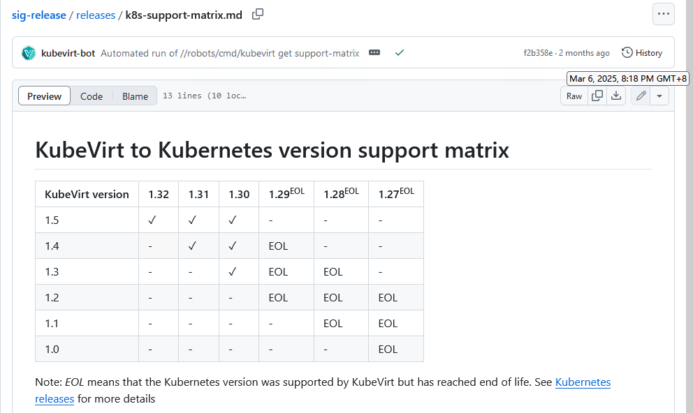
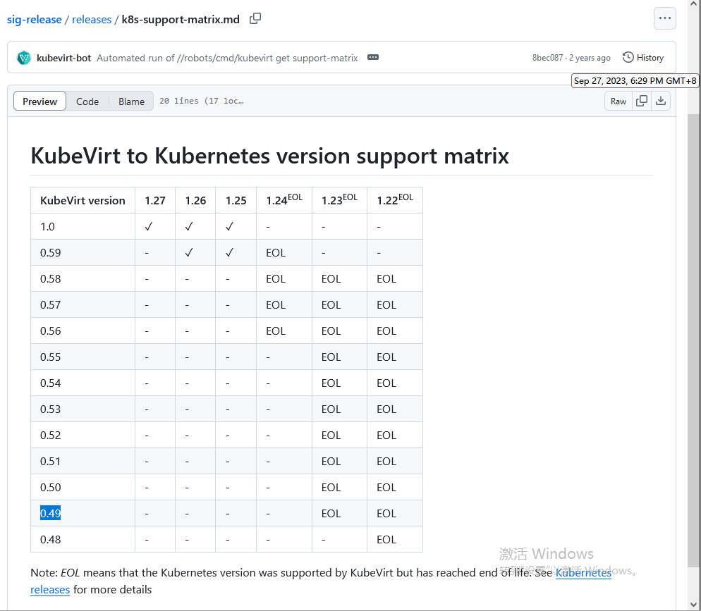

## 一、部署资料

**Links**

- https://kubevirt.io/user-guide/ `topLinks`
  - https://kubevirt.io/user-guide/architecture/
  - https://kubevirt.io/user-guide/cluster_admin/installation/ `admin.Ins,Mgr` [fk-kubevirt-user-guide//docs/cluster_admin](https://gitee.com/g-k8s/fk-kubevirt-user-guide/tree/main/docs/cluster_admin)
  - https://kubevirt.io/user-guide/user_workloads/lifecycle/ `user.Use`
- https://kubevirt.io/user-guide/release_notes/
  - v1.x.x `x64, arm64`
    - v151; KubeVirt v1.5 is built for Kubernetes v1.32 R@Mar 05 2025 `and for the previous two`
    - v140; KubeVirt v1.4 is built for Kubernetes v1.31 R@Nov 13 2024
    - v131; KubeVirt v1.3 is built for Kubernetes v1.30 R@Jul 17 2024
    - v122; KubeVirt v1.2 is built for Kubernetes v1.29 R@Mar 05 2024
    - v111; v110 R@Nov 07 2023
    - v101; v100 R@Jul 11 2023 `+virtctl.linux.arm64`
  - [v0.59.0](https://github.com/kubevirt/kubevirt/releases?q=0.59&expanded=true) R@Mar 1 2023 `v0.59.2:virtctl无arm64版; operatorImg:amd64.only`
  - [v0.49.0](https://github.com/kubevirt/kubevirt/releases?expanded=true&page=2&q=0.49) R@Jan 11 2022 `v0.49.0;  v0.49.1-pre.release`
  - [v0.39.2](https://github.com/kubevirt/kubevirt/releases?expanded=true&page=9&q=v0.39) R@Oct 19 2021 `gh.release:v0.39.1`
  - [v0.29.2](https://github.com/kubevirt/kubevirt/releases?expanded=true&page=13&q=v0.29) R@May 25 2020
  - [v0.19.0](https://github.com/kubevirt/kubevirt/releases?expanded=true&page=17&q=v0.19) R@Jul 5 2019 
  - [v0.9.6](https://github.com/kubevirt/kubevirt/releases?expanded=true&page=20&q=v0.9)  R@Nov 22 2018
- https://github.com/kubevirt/sig-release/blob/main/releases/k8s-support-matrix.md
  - https://gitee.com/g-k8s/fk-kubevirt-sig-release/blob/main/releases/k8s-support-matrix.md `@25.3.6`
  - https://gitee.com/g-k8s/fk-kubevirt-sig-release/blob/8bec087c75fb9c8d5ae25e6ed77ef7cf5c305444/releases/k8s-support-matrix.md `@23.9.27`

**Matrix**





## 二、Install部署尝试

- cmds

> ref jdus-arch-draft//2025/09-kubevirt-vm.md


```bash
# https://kubevirt.io/quickstart_cloud/
# https://kubevirt.io/quickstart_kind/

# operator
# export VERSION=$(curl -s https://storage.googleapis.com/kubevirt-prow/release/kubevirt/kubevirt/stable.txt); echo $VERSION
export VERSION=v1.5.1 #v1.5.1 @25.5.6
kubectl create -f "https://github.com/kubevirt/kubevirt/releases/download/${VERSION}/kubevirt-operator.yaml"
# nested virtualization(inVM)
# kubectl -n kubevirt patch kubevirt kubevirt --type=merge --patch '{"spec":{"configuration":{"developerConfiguration":{"useEmulation":true}}}}'

# cr
kubectl create -f "https://github.com/kubevirt/kubevirt/releases/download/${VERSION}/kubevirt-cr.yaml"

# validate
kubectl get kubevirt.kubevirt.io/kubevirt -n kubevirt -o=jsonpath="{.status.phase}"
kubectl get all -n kubevirt

# virtctl
  # virtctl-v1.5.1-linux-amd64 
  # virtctl-v1.5.1-linux-arm64 
  # virtctl-v1.5.1-windows-amd64.exe 
# VERSION=$(kubectl get kubevirt.kubevirt.io/kubevirt -n kubevirt -o=jsonpath="{.status.observedKubeVirtVersion}")
# ARCH=$(uname -s | tr A-Z a-z)-$(uname -m | sed 's/x86_64/amd64/') || windows-amd64.exe; echo ${ARCH}
ARCH=arm64
curl -L -o virtctl https://github.com/kubevirt/kubevirt/releases/download/${VERSION}/virtctl-${VERSION}-${ARCH}
chmod +x virtctl; sudo install virtctl /usr/local/bin

```

### 1）0509| citydev集群-v1.21.10版

> v0.59..v1.5都不行; TODO:尝试v0.49/v0.39/v0.29

- v151/v140@citydev

```bash
# v1.21.10
[root@(⎈|kubernetes-admin@cluster.local:kubevirt) v140]$ kc version 
  Client Version: version.Info{Major:"1", Minor:"23", GitVersion:"v1.23.17", GitCommit:"953be8927218ec8067e1af2641e540238ffd7576", GitTreeState:"clean", BuildDate:"2023-02-22T13:34:27Z", GoVersion:"go1.19.6", Compiler:"gc", Platform:"linux/amd64"}
  Server Version: version.Info{Major:"1", Minor:"21", GitVersion:"v1.21.10", GitCommit:"a7a32748b5c60445c4c7ee904caf01b91f2dbb71", GitTreeState:"clean", BuildDate:"2022-02-16T11:18:16Z", GoVersion:"go1.16.14", Compiler:"gc", Platform:"linux/amd64"}
  WARNING: version difference between client (1.23) and server (1.21) exceeds the supported minor version skew of +/-1

[root@(⎈|kubernetes-admin@cluster.local:kubevirt) kubevirt]$ kc get po
  NAME  READY   STATUS  RESTARTS   AGE
  virt-operator-844598fdb8-6f96t   0/1  CrashLoopBackOff   7  12m
  virt-operator-844598fdb8-9qd7n   0/1  CrashLoopBackOff   7  12m
[root@(⎈|kubernetes-admin@cluster.local:kubevirt) kubevirt]$ kc logs -f virt-operator-844598fdb8-9qd7n
  runtime/cgo: pthread_create failed: Operation not permitted
  SIGABRT: abort
  PC=0x200b3dc m=0 sigcode=18446744073709551610

  goroutine 0 gp=0x43a9ca0 m=0 mp=0x43ab160 [idle]:
  runtime: g 0 gp=0x43a9ca0: unknown pc 0x200b3dc
  stack: frame={sp:0x7ffe51cf7bc0, fp:0x0} stack=[0x7ffe514fa000,0x7ffe51cf8150)
  0x00007ffe51cf7ac0:  0x000000000044406b <runtime.newextram+0x000000000000002b>  0x000000000362b920 
  0x00007ffe51cf7ad0:  0x000000000040f7ea <runtime.itabInit+0x00000000000003aa>  0x00007ffe51cf7b40 


[root@(⎈|kubernetes-admin@cluster.local:kubevirt) v140]$ kc get po -o wide
  NAME  READY   STATUS  RESTARTS   AGE   IP   NODE  NOMINATED NODE   READINESS GATES
  virt-operator-85556ddcc7-dm4mh   0/1  CrashLoopBackOff   2  53s   10.233.86.36  host21-55    <none>   <none>
  virt-operator-85556ddcc7-k5qvq   0/1  CrashLoopBackOff   2  53s   10.233.110.210   city-dev-worker-01   <none>   <none>
[root@(⎈|kubernetes-admin@cluster.local:kubevirt) v140]$ kc logs -f virt-operator-85556ddcc7-k5qvq
  runtime/cgo: pthread_create failed: Operation not permitted
  SIGABRT: abort
  PC=0x217621c m=0 sigcode=18446744073709551610

  goroutine 0 gp=0x483e220 m=0 mp=0x483f020 [idle]:
  runtime: g 0 gp=0x483e220: unknown pc 0x217621c
```

- try oth's ver `0.49/0.59, v101`

```bash
# 0.49/0.59 无arm版<virtctl, operatorImg>; 从v101版开始有arm的;
# http://172.25.20.115/harbor/projects/38/repositories/v2025/artifacts-tab

# citydev, 部署0.49-x64的operator: 错误2, 暂跳过该v1.21的集群;
[root@(⎈|kubernetes-admin@cluster.local:kubevirt) v0490]$ kc get po -w
  NAME  READY   STATUS    RESTARTS   AGE
  virt-operator-577795f457-9rw5v   0/1  CrashLoopBackOff   2    51s
  virt-operator-577795f457-dldvg   0/1  CrashLoopBackOff   2    51s
[root@(⎈|kubernetes-admin@cluster.local:kubevirt) v0490]$ kc logs -f virt-operator-577795f457-dldvg
  {"component":"virt-operator","level":"info","msg":"can not parse operator image env var harbor.pcitech.com/infrasync/v2025:kubevirt--virt-operator---v0.49.0\n","pos":"application.go:139","timestamp":"2025-05-09T08:04:31.302971Z"}

# 换v101版:
[root@(⎈|kubernetes-admin@cluster.local:kubevirt) v0490]$ kc delete -f kubevirt-operator.yaml 
[root@(⎈|kubernetes-admin@cluster.local:kubevirt) v0490]$ cd ../v101/
[root@(⎈|kubernetes-admin@cluster.local:kubevirt) v101]$ kc apply -f kubevirt-operator.yaml 
  namespace/kubevirt created
  customresourcedefinition.apiextensions.k8s.io/kubevirts.kubevirt.io created
  priorityclass.scheduling.k8s.io/kubevirt-cluster-critical created
  clusterrole.rbac.authorization.k8s.io/kubevirt.io:operator created
  serviceaccount/kubevirt-operator created
  role.rbac.authorization.k8s.io/kubevirt-operator created
  rolebinding.rbac.authorization.k8s.io/kubevirt-operator-rolebinding created
  clusterrole.rbac.authorization.k8s.io/kubevirt-operator created
  clusterrolebinding.rbac.authorization.k8s.io/kubevirt-operator created
  deployment.apps/virt-operator created
  [root@(⎈|kubernetes-admin@cluster.local:kubevirt) v101]$ kc get po -w
  NAME  READY   STATUS  RESTARTS   AGE
  virt-operator-546df8d77d-chfsz   0/1  ContainerCreating   0    4s
  virt-operator-546df8d77d-swrk6   0/1  ContainerCreating   0    4s
  virt-operator-546df8d77d-chfsz   0/1  Error   0    8s
  virt-operator-546df8d77d-chfsz   0/1  Error   1    9s
  ^C[root@(⎈|kubernetes-admin@cluster.local:kubevirt) v101]$ kc logs -f virt-operator-546df8d77d-chfsz
  runtime/cgo: pthread_create failed: Operation not permitted
  SIGABRT: abort
  PC=0x1b50d2c m=0 sigcode=18446744073709551610
  0x00007ffd66dc3890:  0x000000000040528f <runtime.mmap.func1+0x000000000000004f>  0x000000000046f1be <runtime.callCgoMmap+0x000000000000003e> 
  0x00007ffd66dc38a0:  0x00007ffd66dc38a8  0x0000000000000007 
  0x00007ffd66dc38b0:  0x00007ffd66dc3970  0x000000000042e5cd <runtime.(*pageAlloc).update+0x00000000000003ad> 
  0x00007ffd66dc38c0:  0x00007f4896bd4c00  0x0000000001adc11c 
  0x00007ffd66dc38d0:  0x0000000000010000  0x000000000046f1be <runtime.callCgoMmap+0x000000000000003e> 
  0x00007ffd66dc38e0:  0x0000000001b50070  0x000000001c000004 
  0x00007ffd66dc38f0:  0x0000000001adede0  0x0000000000000000

# 换v0.59版: (同v1.x.x版的错误)
[root@(⎈|kubernetes-admin@cluster.local:kubevirt) v101]$ kc delete -f kubevirt-operator.yaml 
[root@(⎈|kubernetes-admin@cluster.local:kubevirt) v101]$ cd ../v0592/
[root@(⎈|kubernetes-admin@cluster.local:kubevirt) v0592]$ kc apply -f kubevirt-operator.yaml
  namespace/kubevirt created
  customresourcedefinition.apiextensions.k8s.io/kubevirts.kubevirt.io created
  priorityclass.scheduling.k8s.io/kubevirt-cluster-critical created
  clusterrole.rbac.authorization.k8s.io/kubevirt.io:operator created
  serviceaccount/kubevirt-operator created
  role.rbac.authorization.k8s.io/kubevirt-operator created
  rolebinding.rbac.authorization.k8s.io/kubevirt-operator-rolebinding created
  clusterrole.rbac.authorization.k8s.io/kubevirt-operator created
  clusterrolebinding.rbac.authorization.k8s.io/kubevirt-operator created
  deployment.apps/virt-operator created
  [root@(⎈|kubernetes-admin@cluster.local:kubevirt) v0592]$ 
  [root@(⎈|kubernetes-admin@cluster.local:kubevirt) v0592]$ kc get po -w
  NAME    READY   STATUS  RESTARTS   AGE
  virt-operator-97c7ddf5d-6kcsw   0/1  ContainerCreating   0    6s
  virt-operator-97c7ddf5d-x2bqf   0/1  ContainerCreating   0    6s
  virt-operator-97c7ddf5d-x2bqf   0/1  Error   0    8s
  virt-operator-97c7ddf5d-6kcsw   0/1  Error   0    9s
  virt-operator-97c7ddf5d-x2bqf   0/1  Error   1    10s
  ^C[root@(⎈|kubernetes-admin@cluster.local:kubevirt) v0592]$ kc logs -f virt-operator-97c7ddf5d-6kcsw
  runtime/cgo: pthread_create failed: Operation not permitted
  SIGABRT: abort
  PC=0x19748ec m=0 sigcode=18446744073709551610

  goroutine 0 [idle]:
  runtime: g 0: unknown pc 0x19748ec
  stack: frame={sp:0x7ffe0d304490, fp:0x0} stack=[0x7ffe0cb05a10,0x7ffe0d304a20)
  0x00007ffe0d304390:  0x000000000041a2d9 <runtime.sysMapOS+0x0000000000000039>  0x0000000000000000 
  0x00007ffe0d3043a0:  0x00007f07bf777000  0x000000000041a265 <runtime.sysHugePageOS+0x0000000000000065> 
  0x00007ffe0d3043b0:  0x00007f07c1a00000  0x0000000000200000


# 重试v0.49版: 
  # ref docs\data\kubevirt\operator\v0490\kubevirt-operator.yaml
  env:
  - name: OPERATOR_IMAGE
    # value: quay.io/kubevirt/virt-operator:v0.49.0
    # value: harbor.pcitech.com/infrasync/v2025:kubevirt--virt-operator---v0.49.0
    # 把value改为标准格式，错误即解决（其用于operator内对于api等镜像前缀的解析； <高版本：可kubevirt-cr.yaml内经imageRegistry额外指定，v0.x则不行了>）
    value: harbor.pcitech.com/kubevirt/virt-operator:v0.49.0

  # 正常后即可完整初始api等组件； 
    [root@(⎈|kubernetes-admin@cluster.local:kubevirt) vm]$ kc get po -o wide
    NAME       READY   STATUS    RESTARTS   AGE    IP   NODE     NOMINATED NODE   READINESS GATES
    virt-api-6b6c8b5869-5szw4    1/1     Running   0    3d3h   10.233.110.6     city-dev-worker-01   <none>     <none>
    virt-api-6b6c8b5869-8qn8g    1/1     Running   0    3d3h   10.233.104.113   city-dev-worker-02   <none>     <none>
    virt-controller-6d4dd4b99d-nz58h   1/1     Running   0    3d3h   10.233.86.9      host21-55      <none>     <none>
    virt-controller-6d4dd4b99d-v7652   1/1     Running   0    3d3h   10.233.110.207   city-dev-worker-01   <none>     <none>
    virt-handler-4lbcx     1/1     Running   0    3d3h   10.233.84.127    host-172-25-21-137   <none>     <none>
    virt-handler-55nh8     1/1     Running   0    3d3h   10.233.64.214    host-172-25-23-30    <none>     <none>
    virt-handler-6wcr6     1/1     Running   0    3d3h   10.233.118.248   host-21-57     <none>     <none>
    virt-handler-6wd24     1/1     Running   0    3d3h   10.233.120.73    host-172-25-20-239   <none>     <none>
    virt-handler-7252w     1/1     Running   0    3d3h   10.233.85.140    host-172-25-20-241   <none>     <none>
    virt-handler-cbqgh     1/1     Running   0    3d3h   10.233.127.49    host-172-25-20-240   <none>     <none>
    virt-handler-ccclc     1/1     Running   0    3d3h   10.233.123.21    host-172-25-23-29    <none>     <none>
    virt-handler-ckp8k     1/1     Running   0    3d3h   10.233.116.249   city-dev-master-01   <none>     <none>
    virt-handler-ff5k6     1/1     Running   0    3d3h   10.233.87.255    host-172-25-21-138   <none>     <none>
    virt-handler-ffn52     1/1     Running   0    3d3h   10.233.73.48     host-172-25-21-56    <none>     <none>
    virt-handler-gvdxg     1/1     Running   1    3d3h   10.233.66.33     vm21-29  <none>     <none>
    virt-handler-hc8lq     1/1     Running   0    3d3h   10.233.111.123   host-21-28     <none>     <none>
    virt-handler-hv2fv     1/1     Running   0    3d3h   10.233.98.136    host-172-25-23-12    <none>     <none>
    virt-handler-jsvw5     1/1     Running   0    3d3h   10.233.70.133    host-172-25-23-28    <none>     <none>
    virt-handler-k726v     1/1     Running   0    3d3h   10.233.110.119   city-dev-worker-01   <none>     <none>
    virt-handler-mgsvx     1/1     Running   0    3d3h   10.233.104.205   city-dev-worker-02   <none>     <none>
    virt-handler-rtgph     1/1     Running   0    3d3h   10.233.113.164   city-dev-master-02   <none>     <none>
    virt-handler-t76mj     1/1     Running   1    3d3h   10.233.95.20     host-172-25-21-18    <none>     <none>
    virt-handler-tnt4g     1/1     Running   0    3d3h   10.233.126.77    host-172-25-23-27    <none>     <none>
    virt-handler-vmp6k     1/1     Running   0    3d3h   10.233.86.37     host21-55      <none>     <none>
    virt-handler-w7c9n     1/1     Running   0    3d3h   10.233.114.93    city-dev-worker-04   <none>     <none>
    virt-handler-wkqqq     1/1     Running   0    3d3h   10.233.77.12     host-172-25-20-238   <none>     <none>
    virt-handler-x872l     1/1     Running   0    3d3h   10.233.125.14    host-172-25-23-15    <none>     <none>
    virt-handler-z8sg6     1/1     Running   0    3d3h   10.233.105.124   city-dev-master-03   <none>     <none>
    virt-launcher-vmi-arm-fcvm4  2/2     Running   0    3d2h   10.233.116.253   city-dev-master-01   <none>     1/1
    virt-operator-787df8db68-p57qx     1/1     Running   0    3d3h   10.233.104.112   city-dev-worker-02   <none>     <none>
    virt-operator-787df8db68-vxx9b     1/1     Running   0    3d3h   10.233.86.136    host21-55      <none>     <none>  
  # 再之后：参考`k3s,ke集群-v1.26版`，部署示例VM运行成功; 
    [root@(⎈|kubernetes-admin@cluster.local:kubevirt) v0490]$ cd ../../vm/
    [root@(⎈|kubernetes-admin@cluster.local:kubevirt) vm]$ ls examples/
    csmall.yaml  vm-cirros-csmall.yaml  vmi-alpine-efi.yaml  vmi-arm.yaml  vmi-fedora.yaml
    [root@(⎈|kubernetes-admin@cluster.local:kubevirt) vm]$ kc apply -f examples/vmi-arm.yaml 
    virtualmachineinstance.kubevirt.io/vmi-arm created
    [root@(⎈|kubernetes-admin@cluster.local:kubevirt) vm]$ kc get vmi -w
    NAME      AGE   PHASE  IP    NODENAME   READY
    vmi-arm   4s    Scheduling  False
    vmi-arm   4s    Scheduled    city-dev-master-01   False
    vmi-arm   4s    Scheduled    city-dev-master-01   False
    vmi-arm   6s    Running      10.233.116.253   city-dev-master-01   False
    vmi-arm   6s    Running      10.233.116.253   city-dev-master-01   True
    vmi-arm   6s    Running      10.233.116.253   city-dev-master-01   True
    ^C[root@(⎈|kubernetes-admin@cluster.local:kubevirt) vm]$ ping 10.233.116.253
    PING 10.233.116.253 (10.233.116.253): 56 data bytes
    64 bytes from 10.233.116.253: seq=8 ttl=63 time=0.716 ms
    64 bytes from 10.233.116.253: seq=9 ttl=63 time=0.663 ms
    64 bytes from 10.233.116.253: seq=10 ttl=63 time=0.753 ms
    ^C
    --- 10.233.116.253 ping statistics ---
    11 packets transmitted, 3 packets received, 72% packet loss
    round-trip min/avg/max = 0.663/0.710/0.753 ms
    [root@(⎈|kubernetes-admin@cluster.local:kubevirt) vm]$ ssh cirros@10.233.116.253
    The authenticity of host '10.233.116.253 (10.233.116.253)' can't be established.
    ECDSA key fingerprint is SHA256:eK+wOSmhYZPvZ+q0546tJOxi+BmEy3S6f2BZTL37mBU.
    Are you sure you want to continue connecting (yes/no/[fingerprint])? yes
    Warning: Permanently added '10.233.116.253' (ECDSA) to the list of known hosts.
    cirros@10.233.116.253's password: 
    $ 
    $ ps -ef |wc
    91       302      2841
    $ uname -a; free -h
    Linux vmi-arm 5.3.0-26-generic #28~18.04.1-Ubuntu SMP Wed Dec 18 16:40:14 UTC 2019 x86_64 GNU/Linux
    BusyBox v1.29.3 (2021-03-05 16:37:57 UTC) multi-call binary.

    Usage: free [-b/k/m/g]

    Display the amount of free and used system memory
    $ uname -a; free -m; uptime 
    Linux vmi-arm 5.3.0-26-generic #28~18.04.1-Ubuntu SMP Wed Dec 18 16:40:14 UTC 2019 x86_64 GNU/Linux
    total       used       free     shared    buffers     cached
    Mem:     225   60  164    0    2   15
    -/+ buffers/cache:   43  182
    Swap:      0    0    0
    04:38:12 up 0 min,  1 users,  load average: 0.09, 0.02, 0.00
```

### 2）0512| k3s,ke集群-v1.26版

> try: v0.59|v1.0|v1.1

- v1.1.1-install

```bash
# https://gitee.com/g-k8s/fk-kubevirt-user-guide/blob/main/docs/cluster_admin/installation.md#installing-kubevirt-on-kubernetes

# 添加 imageRegistry: harbor.pcitech.com/kubevirt
  # ref docs\data\kubevirt\operator\vv111\kubevirt-cr.yaml
  # https://blog.itpub.net/70024420/viewspace-2965242/
  # fk-kubevirt-common-instancetypes\tests\vendor\kubevirt.io\api\core\v1\types_swagger_generated.go
    # "imageRegistry":  "The image registry to pull the container images from\nDefaults to the same registry the operator's container image is pulled from.",

# kubectl taint nodes aiec02-172-28-11-55.kedge aiec01-172.28.11.52.kedge node-role.kubernetes.io/edge:NoSchedule --overwrite

# 11.56机关selinux
[root@(⎈|default:kubevirt) vv111]$ kc logs -f virt-handler-wvml5kc get no
  {"component":"virt-handler","level":"info","msg":"disabled device-plugins for: []","pos":"device_controller.go:352","timestamp":"2025-05-12T01:32:05.282958Z"}
  panic: failed to install virt-launcher selinux policy: failed to install policy /var/run/kubevirt/virt_launcher.cil - out: "Failed to resolve typeattributeset statement at /var/lib/selinux/targeted/tmp/modules/400/virt_launcher/cil:15\nFailed to resolve AST\n/sbin/semodule:  Failed!\n", error: exit status 1
  goroutine 353 [running]:
  main.(*virtHandlerApp).installCustomSELinuxPolicy(0x4000986e00, {0x24bbe20?, 0x400078e280?})
    cmd/virt-handler/virt-handler.go:500 +0x94
  main.(*virtHandlerApp).shouldInstallSELinuxPolicy(0x4000986e00)
    cmd/virt-handler/virt-handler.go:531 +0xf8
  created by kubevirt.io/kubevirt/pkg/virt-config.(*ClusterConfig).SetConfigModifiedCallback
    pkg/virt-config/configuration.go:292 +0x17c

[root@(⎈|default:kubevirt) vv111]$ kc get po -o wide -w
NAME    READY   STATUS    RESTARTS   AGE  IP   NODE   NOMINATED NODE   READINESS GATES
virt-api-6bf4667998-csj7z    1/1  Running   0    37m  10.42.0.112   pci-master-01   <none>  <none>
virt-api-6bf4667998-dxv7k    1/1  Running   1 (18m ago)   37m  10.42.1.181   pci-worker-01   <none>  <none>
virt-controller-686474c9bf-2spx9   1/1  Running   1 (18m ago)   36m  10.42.1.179   pci-worker-01   <none>  <none>
virt-controller-686474c9bf-v6h7r   1/1  Running   0    36m  10.42.0.113   pci-master-01   <none>  <none>
virt-handler-mw26s  1/1  Running   0    36m  10.42.0.114   pci-master-01   <none>  <none>
virt-handler-wvml5  1/1  Running   8 (24m ago)   36m  10.42.1.182   pci-worker-01   <none>  <none>
virt-operator-74f76b4df9-2clsz  1/1  Running   1 (18m ago)   37m  10.42.1.175   pci-worker-01   <none>  <none>
virt-operator-74f76b4df9-xgs2f  1/1  Running   0    2d16h   10.42.0.107   pci-master-01   <none>  <none>
```

- vmi虚机实例运行 `cirros:gocubsgo`

```bash
# 尝试一:
# vm #https://gitee.com/g-k8s/fk-kubevirt-user-guide/blob/main/docs/user_workloads/virtual_machine_instances.md
# docs\data\kubevirt\vm\testvmi-nocloud.yaml 
  # 进不了系统; virtctl console: 在bios页;
  # x64的镜像?? @arm64

# 尝试二: 了解官方客户机demo镜像,尝试换用arm64的客户机镜像;
# guestos-imgs
# https://gitee.com/g-k8s/fk-kubevirt/blob/main/containerimages/container-disk-images.md
  alpine-container-disk-demo Lightweight image for test suite.
  cirros-container-disk-demo Lightweight image for test suite.
  cirros-custom-container-disk-demo Used for e2e testing of custom base paths.
  fedora-cloud-container-disk-demo Fedora cloud edition image.
  fedora-sriov-lane-container-disk Fedora cloud edition image with contains all necessary configuration and drivers for sriov lane tests.

# https://quay.io/organization/kubevirt/ #filer: demo
  kubevirt cirros-registry-disk-demo 	06/20/2019 	87.75 MiB 	
  kubevirt cirros-container-disk-demo 	Today at 9:13 AM 	99.96 MiB 	
  kubevirt cirros-custom-container-disk-demo 	Today at 9:13 AM 	99.96 MiB 	
  kubevirt alpine-ext-kernel-boot-demo 	Today at 9:14 AM 	627.56 MiB 	
  kubevirt alpine-container-disk-demo 	Today at 9:12 AM 	609.91 MiB 	
  kubevirt fedora-cloud-container-disk-demo 	12/06/2021 	848.28 MiB 	
  kubevirt fedora-cloud-registry-disk-demo 	06/12/2019 	292.90 MiB 	
  kubevirt microlivecd-container-disk-demo 	08/24/2022 	275.87 MiB 

# https://quay.io/repository/kubevirt/cirros-container-disk-demo?tab=tags
  # daily
  20250512_ef202ef6bb-arm64 	6 hours ago 	 Unsupported 15.6 MiB 	Never 	
  20250512_ef202ef6bb 	6 hours ago 	 Unsupported 15.0 MiB 	Never   
  # latest ##filterd
  latest 	4 years ago 	 Unsupported	11.6 MiB 	Never 
  # devel ##filterd
    devel 	3 years ago 	 Unsupported 11.6 MiB 	Never 
  # v151
  v1.5.1 	6 days ago 	See Child Manifests 	N/A 	Never #x64, arm64
  v1.5.1-amd64 	6 days ago 	 Unsupported 15.0 MiB 	Never
  v1.5.1-arm64 	6 days ago 	 Unsupported 15.6 MiB 	Never
  # v111 ##filter: v1.1
  v1.1.1 	a year ago 	See Child Manifests 	N/A 	Never #x64, arm64
  v1.1.1-amd64 	a year ago 	 Unsupported 15.0 MiB 	Never
  v1.1.1-arm64 	a year ago 	 Unsupported 15.6 MiB 	Never 
  # v0391
    v0.39.1 	4 years ago 	 Unsupported 11.6 MiB #x64 only

# 换cirros-v111 #x64,arm64版: vmOK
#   docs\data\kubevirt\vm\examples\vmi-arm.yaml
#   image: harbor.pcitech.com/kubevirt/cirros-container-disk-demo:v1.1.1
```

- 虚拟访问: console/ssh; vm/vmi查看;

```bash
# cirros帐号信息
#  https://github.com/cirros-dev/cirros/issues/67 ##cloud-init / nocloud plans 
#  https://github.com/cirros-dev/cirros
    Images are provided for test only. They should not be used in production.
    Images have well known login information. Users can log in with 'cirros:letsgocubs' locally or remotely and have passwordless sudo access to root.

# virtctl-console
[root@(⎈|default:kubevirt) vm]$ virtctl console vmi-arm
  Successfully connected to vmi-arm console. The escape sequence is ^]
  # login as 'cirros' user. default password: 'gocubsgo'. use 'sudo' for root. ###info
  vmi-arm login: cirros
  Password: 
  $ 
  $ sudo su 
  $ ps -ef |wc
  83       269      2505
  $ uname -a
  Linux vmi-arm 5.3.0-26-generic #28~18.04.1-Ubuntu SMP Wed Dec 18 16:41:01 UTC 2019 aarch64 GNU/Linux

# ssh
[root@(⎈|default:kubevirt) vm]$ ssh cirros@10.42.0.116
  # cirros@10.42.0.116\'s password: 
  $ ps -ef |wc
  84       277      2575
  $ uname -a; uptime
  Linux vmi-arm 5.3.0-26-generic #28~18.04.1-Ubuntu SMP Wed Dec 18 16:41:01 UTC 2019 aarch64 GNU/Linux
  08:32:20 up 9 min,  1 users,  load average: 0.00, 0.00, 0.00

# view vmi/vm
  [root@(⎈|default:kubevirt) vm]$ kc get vmi
  NAME  AGE     PHASE     IP      NODENAME  READY
  my-vm       5h19m   Running   10.42.0.115   pci-master-01   True
  testvmi-nocloud   47m     Running   10.42.1.187   pci-worker-01   True
  vmi-arm     14m     Running   10.42.0.116   pci-master-01   True
  [root@(⎈|default:kubevirt) vm]$ kc get vmi -o wide
  NAME  AGE     PHASE     IP      NODENAME  READY   LIVE-MIGRATABLE   PAUSED
  my-vm       5h19m   Running   10.42.0.115   pci-master-01   True    False       
  testvmi-nocloud   47m     Running   10.42.1.187   pci-worker-01   True    False       
  vmi-arm     14m     Running   10.42.0.116   pci-master-01   True    False       
  [root@(⎈|default:kubevirt) vm]$ kc get vm
  NAME    AGE     STATUS    READY
  my-vm   5h19m   Running   True
  [root@(⎈|default:kubevirt) vm]$ kc get vm -o wide
  NAME    AGE     STATUS    READY
  my-vm   5h20m   Running   True
```


## 附

- virtctl -h

```bash
[root@(⎈|default:kubevirt) vm]$ virtctl  -h
virtctl controls virtual machine related operations on your kubernetes cluster.
Available Commands:
  console     Connect to a console of a virtual machine instance.
  scp   SCP files from/to a virtual machine instance.
  ssh   Open a SSH connection to a virtual machine instance.
  vnc   Open a vnc connection to a virtual machine instance.
  create      Create a manifest for the specified Kind.
  start       Start a virtual machine.
  stop  Stop a virtual machine.
  restart     Restart a virtual machine.
  pause       Pause a virtual machine
  unpause     Unpause a virtual machine
  addvolume   add a volume to a running VM
  removevolume      remove a volume from a running VM
  guestfs     Start a shell into the libguestfs pod
  guestosinfo       Return guest agent info about operating system.
  migrate     Migrate a virtual machine.
  migrate-cancel    Cancel migration of a virtual machine.
  # 
  credentials       Manipulate credentials on a virtual machine.
  userlist    Return full list of logged in users on the guest machine.
  fslist      Return full list of filesystems available on the guest machine.
  expand      Return the VirtualMachine object with expanded instancetype and preference.
  expose      Expose a virtual machine instance, virtual machine, or virtual machine instance replica set as a new service.
  port-forward      Forward local ports to a virtualmachine or virtualmachineinstance.
  image-upload      Upload a VM image to a DataVolume/PersistentVolumeClaim.
  permitted-devices List the permitted devices for vmis.
  usbredir    Redirect a usb device to a virtual machine instance.
  memory-dump       Dump the memory of a running VM to a pvc
  vmexport    Export a VM volume.
  soft-reboot       Soft reboot a virtual machine instance
  completion  Generate the autocompletion script for the specified shell
  version     Print the client and server version information.
  help  Help about any command
Use "virtctl <command> --help" for more information about a given command.
Use "virtctl options" for a list of global command-line options (applies to all commands).
```


